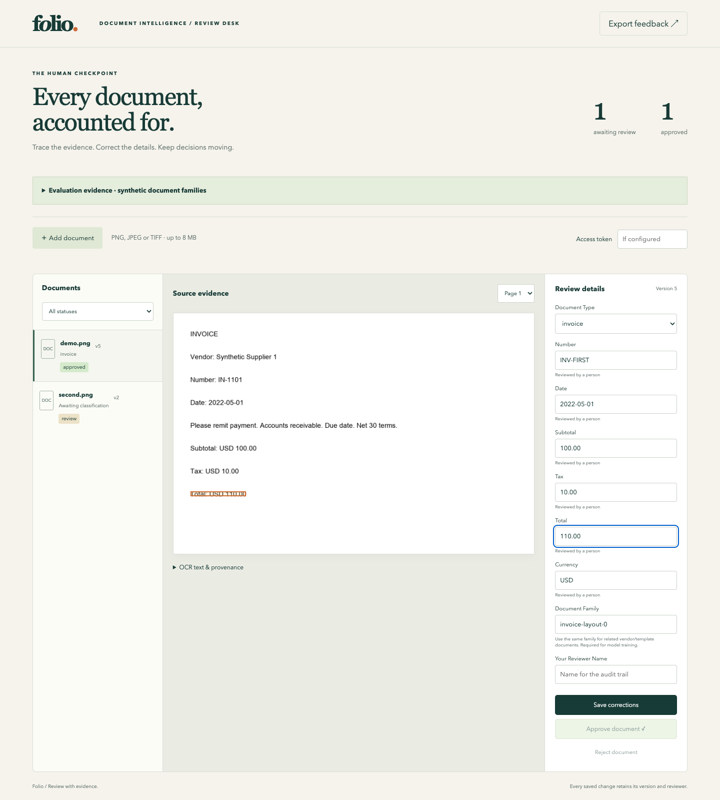

# Folio · Document intelligence review

Turn invoice, purchase-order and receipt images into reviewable structured records. Folio keeps the original page, OCR boxes, normalized fields and reviewer decisions together, so every correction can be traced to its evidence.

See [architecture and design decisions](docs/architecture.md) for component boundaries and the reasoning behind the local store, review transactions and model workflow.



## Start locally

Requirements: Python 3.10, Node 18, Tesseract 5 with English data, and DejaVu Sans or Arial. The container builds Tesseract 5.2.0 and provides the other system dependencies.

```sh
python3.10 -m venv .venv
. .venv/bin/activate
python -m pip install -r requirements-ops.lock
npm ci --prefix frontend --ignore-scripts
npm --prefix frontend run build
python -m docreview demo --data data
python -m docreview serve --data data
```

Open http://127.0.0.1:4800. Select the image, inspect the highlighted source fields, enter a reviewer name and save or approve it. `Export feedback` downloads approved corrections with document hashes and versions. Image uploads accept PNG, JPEG and multi-page TIFF, up to 8 MB and 20 pages. Ambiguous dates require an ISO date or a spelled month.

For Vite development, run `npm --prefix frontend run dev` and open port 4801 while the API runs on port 4800. Set `REVIEW_TOKEN` to protect writes; enter the same token in the review desk. The local workstation should sit behind an authenticated TLS gateway before use across a network.

## Train and serve a model

```sh
python -m docreview train --output artifacts/baseline
python -m docreview registry install --version baseline-v1 --artifact artifacts/baseline/baseline
python -m docreview registry activate --version baseline-v1 --revision 0
MODEL_REGISTRY=data/registry BENTOML_HOME=.bentoml bentoml serve service:svc --port 4803
curl -H 'Content-Type: application/json' -d '{"texts":["Invoice payment due Net 30"]}' http://127.0.0.1:4803/classify
```

Each inference response identifies the model version and registry revision. New models are installed under immutable names; activation uses a revision check. `python -m docreview registry rollback --revision 2` restores the previous verified artifact. Only load trusted local model artifacts: scikit-learn serialization uses executable pickle formats.

For the transformer comparison:

```sh
python -m pip install -r requirements-transformer.lock
python scripts/fetch_model.py
python -m docreview benchmark --epochs 3
```

The downloader verifies the exact DistilBERT revision and each file digest. CPU training uses two threads and batches of four. The evaluation uses 180 project-owned synthetic records across 15 document families: 108 training, 36 calibration and 36 test records. Both models receive identical held-out families. Calibration and threshold selection use only calibration records.

The [measured comparison](docs/evaluation.json) found macro F1 **1.0 for both models** on the 36 synthetic test records. The transformer did not meet the improvement threshold, so the baseline remains the default. These controlled template results do not estimate accuracy on customer documents, handwriting, arbitrary layouts or multilingual data.

## Durable operations

```sh
python -m docreview worker --data data --once
python -m docreview feedback --data data
python -m docreview feedback --data data --select --limit 20
python -m docreview backup snapshot data ../folio-backup
python -m docreview backup restore ../folio-backup ../folio-restored
```

Workers claim durable SQLite leases. Expired leases can be recovered; stale workers cannot overwrite newer results. Three failed attempts terminate processing. Reviewer edits use document versions and preserve an audit event, original extraction value and evidence box. Reviewed documents cannot be overwritten by another OCR pass.

`docker compose up --build` runs the workstation on localhost:4810 after setting `REVIEW_TOKEN`. Data lives in the named volume. See [operations](docs/operations.md) for startup, recovery and verification.

## Verify

See [verification and measured behavior](docs/verification.md) for the completed checks, exact scope and runtime versions.

```sh
BENTOML_HOME=.bentoml python -m unittest discover -s tests -v
node frontend/tests/client.test.mjs
npm --prefix frontend run build
python scripts/browser_check.py
```

Set `CHROMIUM_PATH` to an installed Chromium/Chrome executable, or install the browser supported by the pinned Playwright package. Browser checks create isolated data and processes, then exercise correction, approval, feedback export and source evidence.

To distribute the workstation as a wheel, install `build==0.8.0` and run `python scripts/build_wheel.py`. This builds and embeds the browser assets. Install `requirements-ops.lock` and the resulting wheel on the destination, with Tesseract and its English data available; `docreview serve --data data` then serves the packaged UI without a source checkout or Node runtime.

Original application code is MIT licensed. [Third-party notices](THIRD_PARTY_NOTICES.md) cover model and OCR assets.
