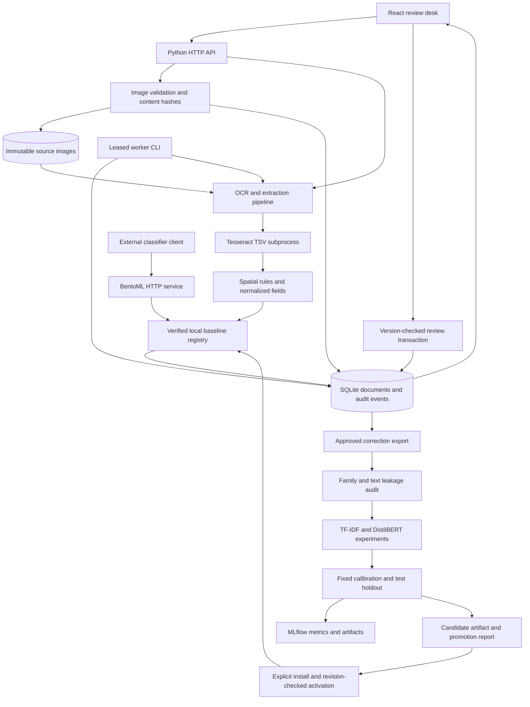

# Architecture and design decisions

Folio is a local document-review workstation with an independently runnable classifier endpoint. Its durable boundary is a SQLite database plus content-addressed page images. Training and evaluation run as explicit commands outside the request path.

The workstation pipeline loads the active local baseline directly. BentoML exposes that same registry to HTTP clients; the workstation does not depend on a second HTTP hop. DistilBERT remains a measured comparison candidate because it did not improve held-out F1. Its saved artifact supports verified offline inference, but the active registry and Bento service currently serve the scikit-learn model.

## Decisions and consequences

| Decision | Reason | Consequence |
| --- | --- | --- |
| SQLite WAL plus image files | Keep local setup and transactional review ownership simple. | A single-store workstation; distributed scheduling and tenant isolation are outside this design. |
| Content hashes identify uploads | Duplicate bytes should reuse one document and retain stable evidence. | Different encodings of the same visual page remain distinct documents. Image hashes are rechecked before OCR and preview. |
| Original images and field boxes remain attached | A reviewer needs visible evidence for an amount or date. | Edits preserve the original extraction and audit history; corrected values do not erase source pixels. |
| OCR runs in a bounded subprocess | Native OCR failure or a slow page must not run indefinitely. | Errors become recoverable processing outcomes; OCR quality still depends on the input layout and scan. |
| Version checks fence both review edits and worker completions | Concurrent tabs and recovered leases must not overwrite newer work. | A stale writer must reload. Reviewed records cannot be replaced by another OCR pass. |
| Vendor/template families define splits | Related documents should not appear in both training and evaluation. | Review feedback needs an explicit, stable family. Missing assignments and known held-out overlaps are rejected. |
| A small baseline precedes the transformer | Compare the cost of learned representations against a strong, cheap text baseline. | The measured synthetic test showed no F1 gain; the baseline remains active. Reported timing is hardware-specific. |
| Calibration is evaluated separately | Threshold selection must use calibration labels without reading test labels. | Offline temperatures and coverage curves do not silently alter deployed raw-confidence routing. |
| Model installation is immutable; activation is revision checked | Rollback needs a verified previous version, and concurrent operators need a conflict check. | Artifacts are validated before activation. Only trusted local pickle artifacts may be installed. |
| Experiments and feedback training do not auto-promote | A reviewer correction is evidence for a new candidate, not authority to replace a model. | The operator reviews the fixed holdout report and explicitly activates an accepted candidate. |
| UI assets ship in both image and wheel | Serving the product should not require a frontend development server. | Node is a build-time dependency; installed wheels serve bundled static assets. |

## Failure and trust boundaries

The API limits encoded request size and total body time; image validation separately checks bytes, pages and dimensions. SQLite persists queue claims and attempts, so expired leases can be recovered after restart. Retry budgets are finite. Backup restoration verifies the complete inventory before creating a fresh destination, and refuses existing targets.

The default API binds to loopback. A write token is a local access control; read access and network identity belong behind an authenticated gateway. Checksums establish artifact consistency, not trust in an arbitrary serialized model. See [operations](operations.md) for limits and recovery exercises, and [verification](verification.md) for the checks actually performed.
