# Operations and recovery

## Components

```mermaid
flowchart LR
  Image[PNG / JPEG / TIFF] --> Intake[Content hash and validated image store]
  Intake --> Queue[SQLite queue and leases]
  Queue --> OCR[Tesseract 5 / page boxes]
  OCR --> Extract[Normalized fields / arithmetic checks]
  Extract --> Model[Active classifier]
  Model --> Review[React evidence and review desk]
  Review --> Audit[Versioned edits and audit trail]
  Audit --> Feedback[Approved correction export]
  Feedback --> Train[Leakage-checked training feedback]
  Train --> Evaluate[Grouped calibration and test]
  Evaluate --> Registry[Verified version registry]
  Registry --> Model
```

## Recovery exercises

1. Start the API with a fresh data directory, then ingest an image twice. The content digest produces one document.
2. Start a worker and terminate it after its claim. After the 60-second lease expires, another worker can claim it. The new document version fences stale completions.
3. Save a review in one browser tab. A second tab holding the previous version receives HTTP 409 and retains its draft until the reviewer reloads.
4. Install a candidate model under a new version and activate it with the expected registry revision. Verify a known input over BentoML HTTP. Roll back and verify the previous prediction and version.
5. Snapshot the SQLite database and content-addressed images. Restore into a new directory; existing targets are refused. Verify the manifest and a real OCR pass after restart.

## Data boundaries

The SQLite database contains OCR text, document names, reviewer identities and field corrections. Images, trained models, MLflow runs, backups and credentials are ignored by Git. Backups include private document data and must use the same access controls as the original. Retention and deletion belong to the deploying organization; do not commit real customer documents as fixtures.

The API defaults to loopback. Its optional access token protects mutation requests; it is not a complete multi-user identity system. Read access, tenant isolation, TLS, secrets rotation and audit export to an external system require a deployment gateway and organizational controls. The supplied container binds only to localhost through Compose.

## Capacity and failure limits

- Upload: 8 MB, at most 20 image pages and 20 million pixels per page.
- OCR: 15-second subprocess deadline, capped at 120 seconds when explicitly configured.
- HTTP JSON body: 12 MB and a 10-second total body deadline.
- Inference: 1–128 texts, at most 100,000 characters each; transformers truncate to the trained token budget.
- Review queries: at most 200 rows per page.
- Worker attempts: three; crash recovery increments the attempt counter.

Health checks establish that the HTTP process is reachable. A successful image-to-review operation and model inference are separate checks. Model artifact checksums detect accidental corruption; they do not make an untrusted pickle safe.
